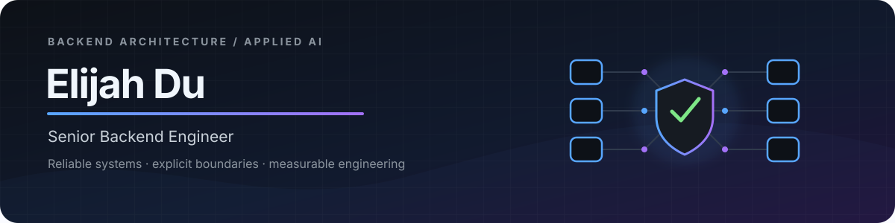

<p align="center">
  
</p>

<p align="center">
  
</p>

<p align="center">
  <a href="https://www.linkedin.com/in/elijahdu/"></a>
  <a href="https://poppycoder.netlify.app/"></a>
  <a href="mailto:poppycoder@gmail.com"></a>
</p>

## Hello

I am a senior backend engineer with **9 years of experience** across fintech, trading, payments and enterprise platforms. I work on systems where reliability has to survive high concurrency, large datasets, asynchronous workflows, search, cloud deployment and production incidents.

My foundation is **Java, Spring Boot and distributed systems**, with recent production work in **Python, FastAPI and AWS**. I care about explicit boundaries, observable behavior and systems that remain understandable as traffic, data and teams grow.

## Engineering focus

| Area | Working experience |
|---|---|
| Backend systems | Java, Spring Boot, Python, FastAPI, REST APIs and microservices |
| Architecture | DDD, distributed systems, consistency, failure handling and asynchronous workflows |
| Data & search | PostgreSQL, MySQL, Redshift, Elasticsearch, Redis, Kafka and RabbitMQ |
| Cloud & operations | AWS, Docker, Kubernetes, CI/CD, tracing, diagnostics and performance tuning |
| Applied AI | Retrieval, evaluation, permission boundaries and human-agent engineering workflows |

## How I work

```text
make the boundary explicit  →  encode the rule  →  test the failure path  →  measure the result
```

- **Clarity under pressure** — production systems should remain understandable when they fail.
- **Architecture as code** — important boundaries belong in types, tests and CI rather than slides alone.
- **Evidence before claims** — retrieval and performance changes need reproducible measurements.
- **Agent-ready engineering** — coding agents should inherit the same constraints and feedback as human contributors.

<p align="center">
  
  
  
  
</p>

## Open-source lab

I use a few public repositories to test ideas, document trade-offs and turn engineering conventions into working examples. They are active, evolving projects rather than finished products.

- [Grounded Access](https://github.com/poppycoderr/grounded-access) — experiments in permission-aware retrieval and reproducible evaluation.
- [Domain Driven Kit](https://github.com/poppycoderr/domain-driven-kit) — reusable Spring Boot patterns and executable architecture rules.
- [codesphere](https://github.com/poppycoderr/codesphere) — technical notes drawn from backend and production work.

## Activity

<picture>
  <source media="(prefers-color-scheme: dark)" srcset="https://raw.githubusercontent.com/poppycoderr/poppycoderr/output/github-contribution-grid-snake-dark.svg" />
  <source media="(prefers-color-scheme: light)" srcset="https://raw.githubusercontent.com/poppycoderr/poppycoderr/output/github-contribution-grid-snake.svg" />
  
</picture>

<p align="center"><strong>Interested in backend and platform work where reliability, architecture and practical AI meet.</strong></p>
